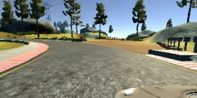
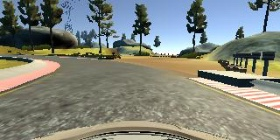
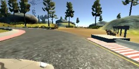
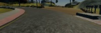
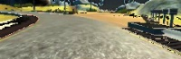
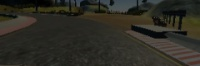
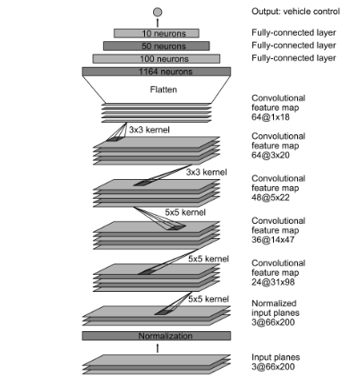
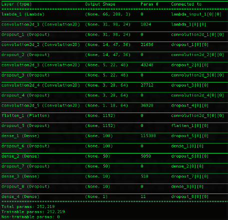

# Behavioral Cloning for Self-Driving Cars

The goal of this project is to train a deep neural network to clone driving behavior by using images to predict steering angles. Once the model is trained, it will be used to drive a car autonomously around a test track in Udacity's driving simulator.

   

## Requirements and Installation

1. Install Anaconda or Miniconda with Python 3.5 and Udacity's carnd-term1 conda environment
    * Follow Udacity's [guide for getting your environment setup](https://github.com/udacity/CarND-Term1-Starter-Kit/blob/master/doc/configure_via_anaconda.md)
2. Clone this repository
    * `git clone https://github.com/ncondo/CarND-Behavioral-Cloning`
3. Download Udacity's sample data and save it in the same directory as model.py
    * [Dataset](https://d17h27t6h515a5.cloudfront.net/topher/2016/December/584f6edd_data/data.zip)
4. Download Udacity's driving simulator
    * [Linux](https://d17h27t6h515a5.cloudfront.net/topher/2016/November/5831f0f7_simulator-linux/simulator-linux.zip)
    * [macOS](https://d17h27t6h515a5.cloudfront.net/topher/2016/November/5831f290_simulator-macos/simulator-macos.zip)
    * [Windows 32-bit](https://d17h27t6h515a5.cloudfront.net/topher/2016/November/5831f4b6_simulator-windows-32/simulator-windows-32.zip)
    * [Windows 64-bit](https://d17h27t6h515a5.cloudfront.net/topher/2016/November/5831f3a4_simulator-windows-64/simulator-windows-64.zip)
    
## Files and Usage

1. model.py
    * Contains all code for reading in training data and training a model to predict steering angles.
    * `python model.py` will train a new model and save the output architecture as model.json and weights as model.h5.
    * Running `python model.py` will overwrite current model.json and model.h5 files - to prevent this rename models you wish to keep.
2. model.json
    * File containing model architecture
    * Created/saved after running `python model.py`
3. model.h5
    * File containing model weights
    * Created/saved after running `python model.py`
4. drive.py
    * Contains code to serve predictions from a trained model to Udacity's simulator for autonomous driving.
    * `python drive.py model.json` will run the model (must have simulator open and in autonomous mode).
    * `python drive.py model.json run1` will run the model and save all images from the run in a new directory with name run1
5. video.py
    * Contains code to create an mp4 video from the previously saved images of an autonomous run.
    * `python video.py run1`

## Solution

### Overview

As a starting point, I used Nvidia's architecture from their white paper [End to End Learning for Self-Driving Cars](http://images.nvidia.com/content/tegra/automotive/images/2016/solutions/pdf/end-to-end-dl-using-px.pdf). Their model proved to be very effective for this problem without much modification, besides hyperparameter tuning and adding dropout and l2 regularization to prevent overfitting. Most of the work done to get my model working was data augmentation and image preprocessing. I will describe the steps taken and the network architecture in further detail below.

### Data Collection

I used only the sample data provided by Udacity to train my model, although one could run the simulator in training mode to gather additional data. Udacity's driving simulator offers two different test tracks, and all sample data was collected from track 1 (the option on the left in the simulator's main screen). One of the optional challenges is to use only training data from track 1 and have the model navigate track 2 successfully; thus showing the model's ability to generalize. 
The data was collected by driving the car around the track in training mode, which records images from three separate cameras: left, center, and right. This is done so that we have data from car being on the left and right sides of the lane, and by adding an offset to the left and right steering angles we can train our model to correct back towards the center of the lane. Using all three of the cameras provides 24,108 samples on which to train.

  

### Data Augmentation and Preprocessing

In an effort to reduce overfitting and increase my model's ability to generalize for driving on unseen roads, I artificially increased my dataset using a couple of proven image augmentation techniques. One method I used was randomly adjusting the brightness of the images. This is done by converting the image to HSV color space, scaling up or down the V channel by a random factor, and converting the image back to RGB. Another technique I used was flipping the image about the vertical axis and negating the steering angle. The idea here is to attempt to get an equal number of left and right steering angles in the training data to reduce any possible bias of left turns vs right turns or vice versa.
The original size of each image is 160x320. I crop the top 40 pixels and the bottom 20 pixels from each image in order to remove any noise from the sky or trees in the top of the images and the car's hood from the bottom of the image. This results in image sizes of 100x320, which I then resize to 66x200, which is the input size of the neural network.

  

### Network Architecture

The network consists of 9 layers, including a normalization layer, 5 convolutional layers, and 3 fully-connected layers. The first layer accepts an rgb image of size 66x200x3 and performs image normalization, resulting in features ranging from values -1.0 to 1.0. The first convolutional layer accepts input of 3&#64;66x200, has a filter of size 5x5 and stride of 2x2, resulting in output of 24&#64;31x98. The second convolutional layer then applies a filter of size 5x5 with stride of 2x2, resulting in and output of 36&#64;14x47. The third convolutional layer then applies a filter of size 5x5 with stride of 2x2, resulting in output of 48&#64;5x22. The fourth convolutional layer applies a filter of 3x3 with stride of 1x1 (no stride), resulting in output of 64&#64;3x20. The fifth and final convolutional layer then applies a filter of 3x3 with no stride, resulting in output of 64&#64;1x18. The output is then flattened to produce a layer of 1164 neurons. The first fully-connected layer then results in output of 100 neurons, followed by 50 neurons, 10 neurons, and finally produces an output representing the steering angle. A detailed image and summary of the network can be found below. I use dropout after each layer with drop probabilities ranging from 0.1 after the first convolutional layer to 0.5 after the final fully-connected layer. In addition, I use l2 weight regularization of 0.001. The activation function used is the exponential linear unit (ELU), and an adaptive learning rate is used via the Adam optimizer. The weights of the network are trained to minimize the mean squared error between the steering command output by the network and the steering angles of the images from the sample dataset. This architecture contains about 27 million connections and 252 thousand parameters.

  

### Training Details

The data provided by Udacity contains only steering angles for the center image, so in order to effectively use the left and right images during training, I added an offset of .275 to the left images and subtracted .275 from the right images. This is because an angle of 0 corresponds with the car going straight, left turns are negative, and right turns are positive. The angle of .275 was found by trial and error, since the distance between the cameras was not given. I also limited the number of angles less than the absolute value of 0.1 to a maximum of 50% of any given batch. This is done to prevent a bias towards the car driving straight, since the provided data had a high proportion of small angles. Also, images are flipped with their steering angle negated with probability of .5 in order to achieve a balanced distribution of left and right turns in the training data. Also in regards to balanced data: images are randomly selected by index, then by left, center, or right in efforts to create a balanced dataset.
Training is done via a keras fit generator, which constantly feeds the model data for a specified number of epochs and samples per epoch. The generator is used so that the training data is only loaded into memory in batches, as all of the training data cannot be loaded at once due to memory contraints. My model was trained for 28 epochs with 24,000 samples per epoch and batch sizes of 64. The samples per epoch being set at 24,000 is due to the fact the an epoch is generally defined as a complete pass through the entire dataset, which was just over 24,000. I arrived at 28 epochs through complete trial and error. I originally set epochs to 40, but the model seemed to be overfitting at that number. I split my data into training and validation at a rate of 90/10, and my validation error was lowest at aroung 0.03 after 28 epochs.

### Evaluation

The model is able to successfully navigate both track 1 and track 2 without much trouble. There are a couple areas of track 1 where the steering isn't very smooth, specifically around the first sharp turn. Surprisingly, the model performs better on track 2, from which it hasn't seen any sample data. The drive on track 2 is flawless and the car almost always stays in the center of the track. Overall, I am very happy with the outcome of this project and I look forward to one day testing some of my models on a real car. 

You can find full vidoes of my test runs here: [Track 1](https://youtu.be/rA6xbC0J1aQ) [Track 2](https://youtu.be/ajTGP91XADg)

